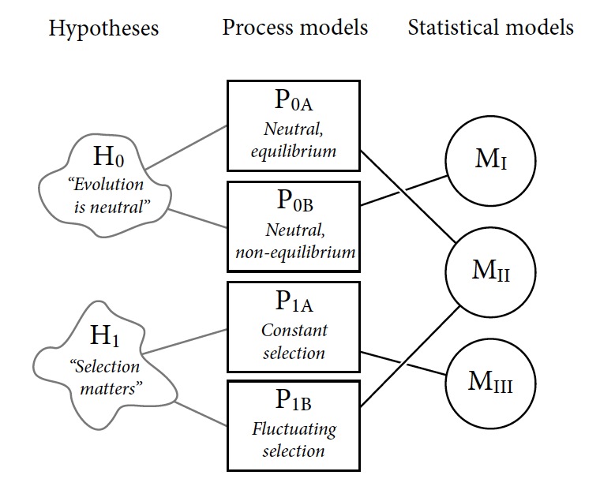
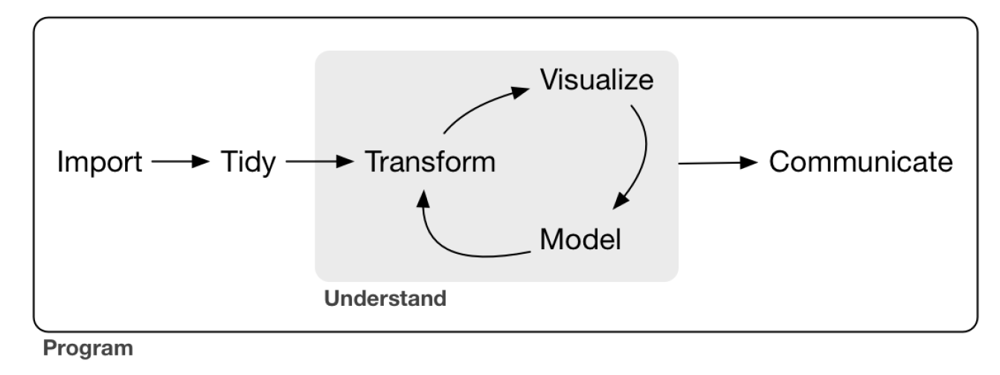
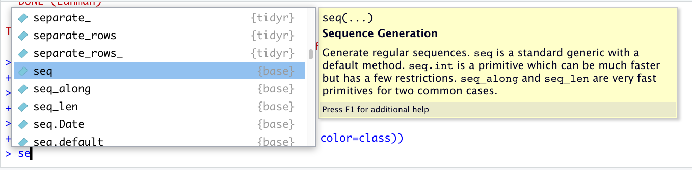

```{r setup, include=FALSE}
knitr::opts_chunk$set(echo = TRUE)
```

```{r functions, include=FALSE}
# A function for captioning and referencing images
fig <- local({
    i <- 0
    ref <- list()
    list(
        cap=function(refName, text) {
            i <<- i + 1
            ref[[refName]] <<- i
            paste("Figure ", i, ": ", text, sep="")
        },
        ref=function(refName) {
            ref[[refName]]
        })
})
```

# Notes from Rethinking Statistics

## The golem of Prague

## 1.1 Statistical golems

### Statistics as a branch of engineering

-   A set of recipes (statistical tests) are handed out in service courses.
-   There are many causes for this situation.

## 1.2 Statistical Rethinking

### Rethinking statistical inference

-   Develop a set of strategies rather than a set of recipes

### Null Hypothesis Significance Testing

-   Falsifying the null hypothesis, not the hypothesis
-   In my opinion, an artifact of the frequentist approach
-   In my opinion, this does not reflect how science is really done.

### Uniqueness problem in mapping of Hypotheses to Statistical Models

{width="80%"}

### Falsification is consensual

## 1.3 Tools for golem engineering

1.  Bayesian statistical analysis
- Frequentist approach defines probability in term of the frequency of a very large number of imaginary events.
- It is a major challenge not to equate probability with frequency in Bayesian Data Analysis

2.  Model comparison and prediction

3.  Multilevel models

-   hierarchical, random effects, varying effects, or mixed effects models
-   The levels are layers of parameters
-   Helpful in dealing with overfitting
-   **Partial pooling** of data into sub-units to produce better estimates for all sub-units

-   Applications of **partial pooling**:

    -   Adjust parameter estimates for repeated sampling of the same sample
    -   Adjust parameter estimates for the imbalances in sampling
    -   Model variation between groups of samples.
    -   Preserve the uncertainty in pre-averaged values (premature averaging can degrade the downstream analyses)

4.  Graphical Casual Models

-   The Identification Problem: the problem of identifying causes in cause and effect relationships
-   Need casual models in addition to statistical models to do casual inference.
-   DAG Directed Acyclic Graphs

## Book Outline

1.  Chapters 2-3: Probability theory behind Bayesian inference.
2.  Chapters 4-8: multiple linear regression as a Bayesian tool
3.  Chapters 9-12: generalized linear models (MCMC, maximum entropy, GLMs)
4.  Chapters 13-16: Multilevel models, including measurement error and covariation.


# R for Data Science

## Introduction

-   [R for Data Science](https://r4ds.had.co.nz/introduction.html) could have been titled the *Introduction to the Tidyverse*. The tidyverse could be considered as a fork of R. It is a toolkit to ease doing data science.

{width="80%"}

-   **tidy** When data are tidy, there is one row per observation and one column per variable.
-   **transform** narrowing to observations of interest, calculating derived variables, and calculating summary statistics
-   **visualization and modeling** Two tools for generating new knowledge and understanding.
-   **communication** essential step
-   **programming** Provides the tools for doing all parts.

The combination of data tidying and transfroming is known as *data wrangling*. The author makes analogy to the global definition of wrangling, which refers to politicians haggling or struggling over issues. I prefer the analogy to the North American definition of rounding up scattered horses because my data are often in a scattered and disorganized state initially.

### Plan of book

1.  data visualization
2.  data wrangling\
3.  progamming
4.  model
5.  Communication (Rmarkdown)

### Prerequisites

-   R
-   Rstudio (or your favorite text editor with a R repl).

    + In Emacs, you can use org documents with jupyter-R via org-babel and emacs-jupyter packages.
    + Alternatively, you can edit Rmarkdown directly in Emacs and evaluate the code blocks. See this [post](https://plantarum.ca/2021/10/03/emacs-tutorial-rmarkdown) for an introduction.
    + In Jupyter, you can install and use the R kernel (you to install R first). Jupytext or pandoc can be used to conver the ipynb file to other formats.
    + [radian](https://github.com/randy3k/radian) The Ipython-like console for R.
    + [quarto](https://quarto.org/) The org-babel for Rstudio. Write in markdown. Set up for R (via knitr), Julia (via IJulia i.e., Jupyter), and Python via Jupyter. For the latter, you specify the kernel, so in principle quartp for Python could handle every programming language for which there is a Jupyter kernel. This would solve the snippet problem in Jupyter.

### Installation of the tidyverse

```{r}
install.packages("tidyverse")
```

```{r}
library("tidyverse")
```

```{r}
tidyverse_update()
```

```{r}
install.packages(c("nycflights13", "gapminder", "Lahman"))
```

## Chapter 3. Data Visualization with **ggplot2**

### mpg dataframe

```{r}
mpg
```

To get documentation on mpg, enter:

```{r}
?mpg
```

### ggplot() creates the coordinate system onto which the plot elements are added as layers.

```{r}
ggplot(data=mpg)
```

### geom_point() adds a layer of scatterplot points.

You must specify the x and y variables. The use of color is an example of aesthetic mapping.

```{r, fig.cap="Scatterplot of mpg vs. engine size."}
ggplot(data = mpg) + 
  geom_point(mapping = aes(x = displ, y = hwy, color=class))
```

### geom\_ will trigger intellisense feature

```{r}
geom_
```

### Histogram of vehicle class

```{r}
ggplot(mpg, aes(class)) +
  geom_histogram(stat="count")
```


### Facets == subplots

```{r}
ggplot(data = mpg) + 
  geom_point(mapping = aes(x = displ, y = hwy)) + 
  facet_wrap(~ class, nrow = 2)
```

### Geometric Objects
A plot uses a **geom** or geometrical object to represent data. 

Every geom function in ggplot2 takes a mapping argument. However, not every aesthetic works with every geom.

```{r}
# left
ggplot(data = mpg) + 
  geom_point(mapping = aes(x = displ, y = hwy))

# right
ggplot(data = mpg) + 
  geom_smooth(mapping = aes(x = displ, y = hwy))
```
Can display mulitple geoms in one plot:

```{r}
ggplot(data = mpg) + 
  geom_point(mapping = aes(x = displ, y = hwy)) +
  geom_smooth(mapping = aes(x = displ, y = hwy))
```


### Statistical Transformations

```{r}
ggplot(data = diamonds) + 
  geom_bar(mapping = aes(x = cut))
```
Every **geom** has a default **stat**; and every **stat** has a default **geom*8. 

```{r}
ggplot(data = diamonds) + 
  stat_count(mapping = aes(x = cut))
```


### Position Adjustments

position = "dodge" places overlapping objects directly beside one another.

```{r}
ggplot(data = diamonds) + 
  geom_bar(mapping = aes(x = cut, fill = clarity), position = "dodge")
```
### Overplotting addressed with jitter

position = "jitter" adds a small amount of random noise to each point.


```{r}
ggplot(data = mpg) + 
  geom_point(mapping = aes(x = displ, y = hwy), position = "jitter")
```

## Coordinate systems

### Flipping X and Y to a horizontal box plot

```{r}
ggplot(data = mpg, mapping = aes(x = class, y = hwy)) + 
  geom_boxplot()
ggplot(data = mpg, mapping = aes(x = class, y = hwy)) + 
  geom_boxplot() +
  coord_flip()
```


## Chapter 4. Workflow

### Assignment operator
 
```{r}
object_name <- value
```


### Naming conventions

```{r}
snakecase wickham_favors_snakecase
pascalCase iFavorPascalCase
```

Just be consistent. Develop a style guide for your group.

Case matters.

### Calling Functions

{width="140%"}
```{r}
A <- seq(1,12)
A
```


```{r}
(seq(1,12))
```

