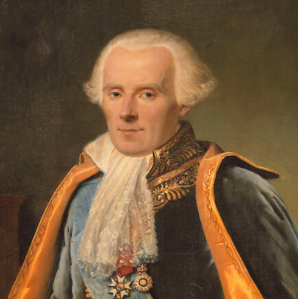

# Motors for Bayesian Models

- Grid approximation
- Quadratic approximation (Laplace's method)
- Markov Chain Monte Carlo (MCMC)

### Features of the grid approximation

- compute posterior at each grid point
- grid spacing determines the precision of the approximation
- simple to compute
- limited to 5-D by computational costs
- robust method in the presence of multiple modes

### Recap of the Grid Approximation

A. Five-step protocol in one dimension.

1.  Define a grid

```{r}
p_grid <-seq(from=0,to=1,length.out=100)
```

2.  Define the prior

```{r}
prior <-rep(1,100)/sum(rep(1,100))
sum(prior)
```

3.  Compute the likelihood at each value in grid

```{r}
likelihood <- dbinom(6,size=9,prob=p_grid)
sum(likelihood)
```

4.  Compute product of likelihood and prior

```{r}
unstd.posterior <-likelihood*prior
```

5.  Standardize the posterior, so it sums to 1.

```{r}
posterior <-unstd.posterior/sum(unstd.posterior)
sum(posterior)
```

```{r}
plot( p_grid, posterior, 
      type="b",
      xlab="probability ofwater",
      ylab="posteriorprobability")
mtext( "100 points")
```
```{r}
p_grid <-seq(from=0,to=1,length.out=100)
prior <-rep(1,100)/sum(rep(1,100))
sum(prior)
likelihood <-dbinom(6,size=9,prob=p_grid)
sum(likelihood)
unstd.posterior <-likelihood*prior
posterior <-unstd.posterior/sum(unstd.posterior)
sum(posterior)
plot( p_grid, posterior, 
      type="b",
      xlab="probability ofwater",
      ylab="posteriorprobability")
mtext( "100 points")
```

### Repeat with Step prior

```{r}
sprior <- ifelse(p_grid < 0.5, 0, 1)/sum(ifelse(p_grid < 0.5, 0, 1))
sum(sprior)
slikelihood <-dbinom(6,size=9,prob=p_grid)
unstd.sposterior <-slikelihood*sprior
sposterior <-unstd.sposterior/sum(unstd.sposterior)
sum(sposterior)

plot( p_grid, sposterior, 
      type="b",
      xlab="probability of water",
      ylab="posterior probability")
points(p_grid, sprior, col='magenta')
points(p_grid, posterior, col='cyan')
mtext( "Step prior, 100 grid points")

legend(x = "topright",
       c("sposterior", "sprior", "posterior"),
       cex=.8,
       col=c("black","magenta","cyan"),
       lwd = 2,
       bty = "n"
       )  
```


### Example of a multimodal distribution

{width="70%"}
## Quadratic approximation

### Pierre Simon Laplace

- France's Issac Newton
- Proved the general form of the Central Limit thereom
- Proved a Bayesian interpretation of linear least-squares
- Developed Laplace's transform
- Developed the spherical harmonics


{width="30%"}

### A Philosophical Eassy on Probability

{width="20%"}

[Source on the Internet Archive](https://archive.org/details/philosophicaless00lapliala/page/n5/mode/2up)


There is a newer translation by Andrew I. Dale in 1998 and 2012 published by Springer.
It is suppose to be easier to read than the 1902 version and there is commentary on the mathematical notation.


Andrew Dale also wrote 

Dale, A.I. (2012) \emph{A history of inverse probability: From Thomas Bayes to Karl Pearson} Springer Science & Business Media.

and 

Dale, A.I. (2003) Most Honourable Remembrance: The Life and Work of Thomas Bayes. Springer.

### McGrayne's book

{width="40%"}

### Compute the quadratic approxmatiation using the quap function from the rethinking library

```{r}
library(rethinking)
globe.qa <- quap(
  alist(
     W ~ dbinom(W+L, p), # binomial likelihood
     p ~ dunif(0,1)   # uniform prior
  ),
  data=list(W=6, L=3) )

# display summary of quadratic approximation
precis(globe.qa)
```

```{r}
# analytical calculation
W <-6
L <-3
curve( dbeta(x,W+1,L+1),from=0,to=1)
# quadraticapproximation
curve( dnorm(x,0.67,0.16),lty=2,add=TRUE)
```


#### Now double the amount of data


```{r}
globe.qa <- quap(
  alist(
     W ~ dbinom(W+L, p), # binomial likelihood
     p ~ dunif(0,1)   # uniform prior
  ),
  data=list(W=12, L=6) )

# display summary of quadratic approximation
precis(globe.qa)
```

```{r}
# analytical calculation
W <-12
L <-6
curve( dbeta(x,W+1,L+1),from=0,to=1)
# quadraticapproximation
curve( dnorm(x,0.67,0.11),lty=2,add=TRUE)
```

#### Now double the data again:


```{r}
globe.qa <- quap(
  alist(
     W ~ dbinom(W+L, p), # binomial likelihood
     p ~ dunif(0,1)   # uniform prior
  ),
  data=list(W=24, L=12) )

# display summary of quadratic approximation
precis(globe.qa)
```
Plug the new sd into the quadratic approximation formula.
We finally get more reasonable approximation.


```{r}
# analytical calculation
W <-24
L <-12
curve( dbeta(x,W+1,L+1),from=0,to=1)
# quadraticapproximation
curve( dnorm(x,0.67,0.08),lty=2,add=TRUE)
```

#### Now double the data again:


```{r}
globe.qa <- quap(
  alist(
     W ~ dbinom(W+L, p), # binomial likelihood
     p ~ dunif(0,1)   # uniform prior
  ),
  data=list(W=48, L=24) )

# display summary of quadratic approximation
precis(globe.qa)
```

```{r}
# analytical calculation
W <-48
L <-24
curve( dbeta(x,W+1,L+1),from=0,to=1)
# quadraticapproximation
curve( dnorm(x,0.67,0.06),lty=2,add=TRUE)
```


### Caveats about the Quadration Approximation

- The fit generally improves with more data.
- Sometimes, it can remain a poor approximation even with 1000s of data points.
- With a lot of data or an uniform prior, this approach is equavilent to a Maximum Likelihood Estimate (MLE).
- When equivalent to MLE, can reinterpret the model fits in terms of a Bayesian analysis.
- Shares the drawbacks of MLEs.
- Computing a Hessian is required to get the standard deviation. This computation can go wrong.


## Markov Chain Monte Carlo (MCMC)


Multi-level or hierarchical models are common and have large numbers of parameters.
Grid approximation and Quadratic approximation are often not adquate for large models.

MCMC merely draws samples from the posterior rather than computing the posterior directly.
The frequencies of the parameter values of these samples is proportional to their posterior plausability.
The histogram of these samples gives a picture of the posterior.
So with MCMC, we work with samples rather then with an estimate of the posterior distribution.

### MCMC orginiated with the need to estimate high dimensional integrals

#### 2-D example 

Source: Sobol, I. M. (1994). \emph{A primer for the Monte Carlo method.} CRC press.

The ratio of the number of points inside the boundary and outside give the proportion of the square occupied by the irregular area.


#### The bounding area could be another curve

Source: Robert, C. P., Casella, G., and Casella, G. (2010). \emph{Introducing Monte Carlo methods with R}. New York: Springer.


### Originated at Los Alamos in the late 1940s during work on the H-bomb

\begin{equation}
P(\Delta E)=e^{-\Delta E / k T}
\end{equation}
  
1. Make a move (e.g., select a sample, change a torsion angle, translate the ligand, rotate the ligand)
2. Calculate the energy ($E$)
3. Compare E to prior $E^{\circ}$

    - If $\Delta E < 0$, accept the move
    - If $\Delta E > 0$, accept move if a randomly selected number between 0 and 1 is less then $P$. Otherwise, reject the move.


Source: Metropolis, Nicholas; Rosenbluth, Arianna W.; Rosenbluth, Marshall N.; Teller, Augusta H.; and
Teller, Edward (1953) Equation of state Calculations by Fast Computing Machines. The Journal of
Chemical Physics. 21(6):1087.


### 


### MCMC applied to generating samples from the posterior for the globe tossing problem

#### Example using the Metropolis algorithm with 1000 samples.

```{r}
n_samples <-1000
p <-rep(NA,n_samples)
p[1] <- 0.5
W <-6
L <-3
for (i in 2:n_samples){
    p_new <-rnorm(1,p[i-1],0.1)
    if (p_new<0) p_new <- abs(p_new)
    if (p_new>1) p_new <- 2 - p_new
    q0 <- dbinom(W,W+L,p[i-1])
    q1 <- dbinom(W,W+L,p_new)
    p[i] <- ifelse(runif(1)<q1/q0,p_new,p[i-1])
}
dens( p, xlim=c(0,1))
curve( dbeta(x,W+1,L+1),lty=2,add=TRUE)
```

#### Example using the Metropolis algorithm with 10,000 samples.

```{r}
n_samples <-10000
p <-rep(NA,n_samples)
p[1] <- 0.5
W <-6
L <-3
for (i in 2:n_samples){
    p_new <-rnorm(1,p[i-1],0.1)
    if (p_new<0) p_new <- abs(p_new)
    if (p_new>1) p_new <- 2 - p_new
    q0 <- dbinom(W,W+L,p[i-1])
    q1 <- dbinom(W,W+L,p_new)
    p[i] <- ifelse(runif(1)<q1/q0,p_new,p[i-1])
}
dens( p, xlim=c(0,1))
curve( dbeta(x,W+1,L+1),lty=2,add=TRUE)
```

#### Example with 100,000 samples

```{r}
n_samples <-100000
p <-rep(NA,n_samples)
p[1] <- 0.5
W <-6
L <-3
for (i in 2:n_samples){
    p_new <-rnorm(1,p[i-1],0.1)
    if (p_new<0) p_new <- abs(p_new)
    if (p_new>1) p_new <- 2 - p_new
    q0 <- dbinom(W,W+L,p[i-1])
    q1 <- dbinom(W,W+L,p_new)
    p[i] <- ifelse(runif(1)<q1/q0,p_new,p[i-1])
}
dens( p, xlim=c(0,1))
curve( dbeta(x,W+1,L+1),lty=2,add=TRUE)
```


